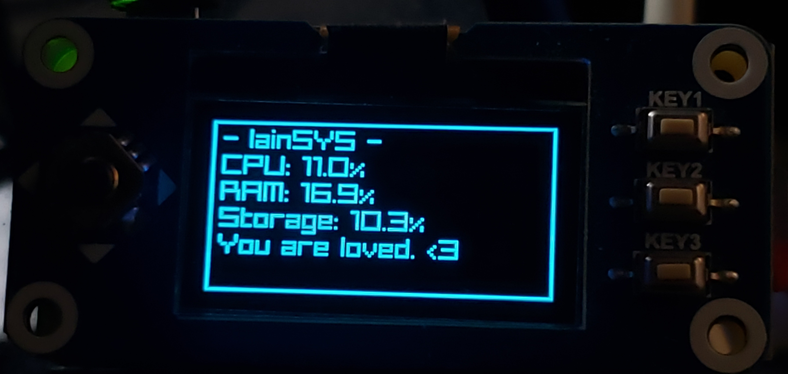
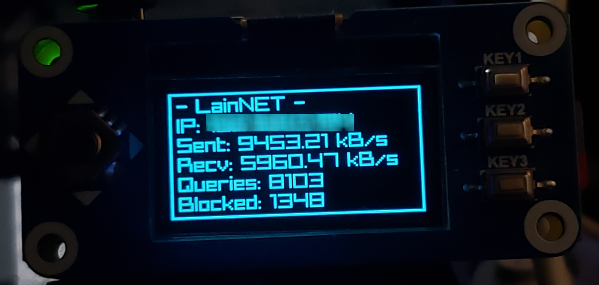

# PiHOLED
PiHOLED is a basic Python script to display Raspberry Pi, Network & PiHole statistics on SH1106-based 1.3 inch (128x64) OLED display HATs, such as the Waveshare 1.3inch OLED Raspberry Pi HAT (can be modified to run on SSD1306-based HATs). Tested on a Raspberry Pi Zero W running DietPi but should theoretically work on any SBC + distro combination with a similar GPIO pinout. 

Supports safe reboot by holding KEY1 for 3 seconds, safe shutdown by holding KEY2 for 3 seconds, rotating between brightness settngs with KEY3, and switching between System / Network monitoring using the joystick (left + right).

<i> An aesthetically modified build of PiHOLED using the supErphoniX2 font. </i> 

## Features:
### Menus:
- Hardware - Shows your CPU, RAM and storage.
- Network - Shows your IP address, sent/received packets, and both total and blocked queries from PiHole.
- Music - Shows your currently playing Spotify track! (WIP)
- Games - Shows your current running emulator/core, system name & game name! (WIP)

### Buttons:
KEY1 - Hold for 3 seconds to safely reboot.
KEY2 - Hold for 3 seconds to shutdown.
KEY3 - Press to cycle LCD brightness, hold mapping isn't set (yet) but you can modify the code to easily use it for whatever!
Joystick - L/R switches between menu pages, U/D does nothing (yet?)

## Requirements:
- SPI + I2C enabled in DietPi/Raspbian (or similar distro)
- python3
- python3-pip
- libopenjp2-7
- psutil (pip)
- requests (pip)
- luma.oled (pip)
- gpiozero (pip)

To install these on DietPi, install Python & RPi.GPIO via the DietPi Software installer & afterwards type "sudo apt install libopenjp2-7 && pip3 install psutil requests luma.oled" into your terminal. 

For non-DietPi users, type "sudo apt install python3 python3-pip libopenjp2-7 && pip3 install psutil requests luma.oled gpiozero" instead, and modify the .service file to reflect your username.

## How to install:
- Download PiHOLED.py
- Copy PiHOLED.py to your /home/dietpi directory
- Edit PiHOLED.py & replace <YOURAUTHTOKEN> with your the contents of "WEBPASSWORD" in "/etc/pihole/setupVars.con".
- Copy the PiHOLED.service script to /lib/systemd/system
- Type "systemctl enable PiHOLED && systemctl start PiHOLED"

## Configuration:
- Rotate Screen: You can rotate the screen 180 degrees by finding "rotate=2" and changing it to "rotate=0" (or vice versa).

## How to use with SSD1306-based HAT:
- Open PiHOLED.py in Nano or a similar text editor
- Change any instance of "sh1106" to "ssd1306"

## TBD:
- Choose better font for increased visual clarity. (supErphoniX2 works great at size 9 but it's not open-source).
- Add an option to cycle between menu states automatically (for SH1106/SSD1306 LCDs without physical controls).
- Further optimize CPU usage
## Bugs:
- CPU usage spikes by about 10% when screen refreshes, seemingly fine if you're just running PiHole but any headroom lost is still headroom lost. As far as I can tell from testing other similar Python scripts, this amount of CPU usage is about expected, but I would love to be shown otherwise.

Any and all feedback (optimizations, etc) is appreciated! Although feature requests will most likely be ignored as the scope of this project (basic PiHole + Pi statistics) has largely been covered already.
